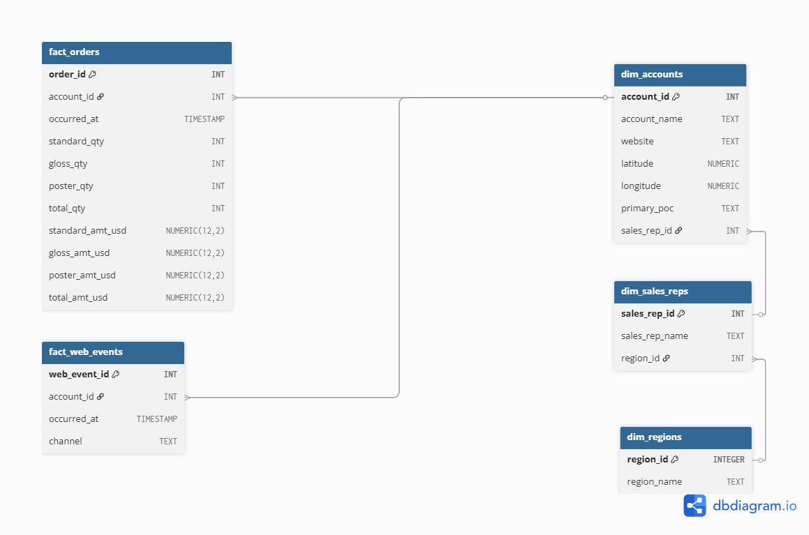
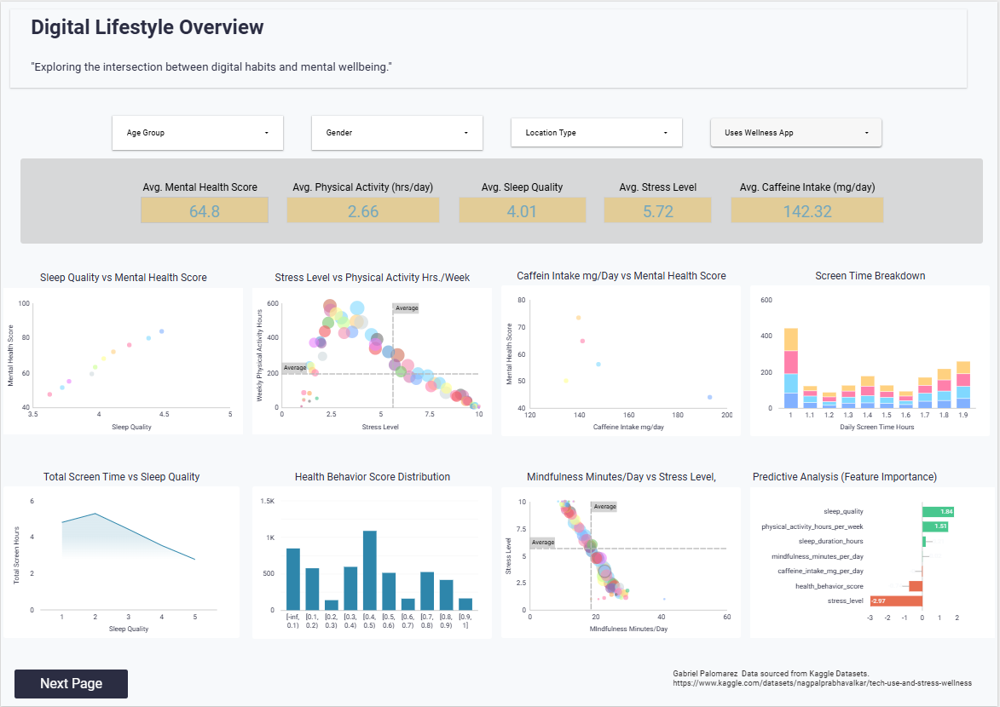
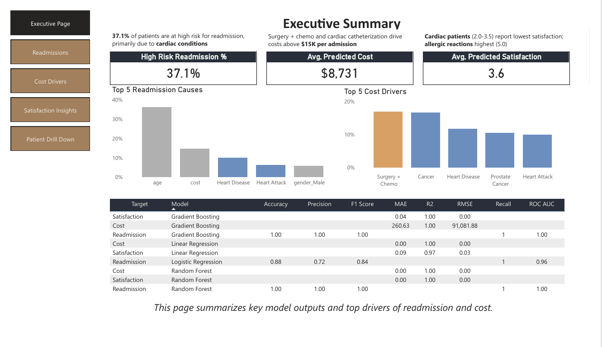

# 👨‍💻 Gabriel Palomarez | Data Analytics Portfolio

**[LinkedIn](https://www.linkedin.com/in/gabrielpalomarez)** • **gpalo23@icloud.com** • **[Resume](./resume/Gabriel_Palomarez_Analytics_Manager_2026.pdf)**

## 📊 Data Analyst | Business Intelligence Specialist | Healthcare Analytics
*Transforming complex operational data into automated solutions that drive measurable business value*

---

## 🎯 About This Portfolio

This portfolio showcases my work in analytics automation, operational reporting, and data-driven decision support across healthcare and enterprise environments. Each project demonstrates end-to-end analytical capability from problem identification through solution deployment.

**What you'll find here:**
- 📊 **Interactive dashboards** reducing reporting time by 90%+
- 🐍 **Python automation scripts** eliminating manual workflows
- 📈 **SQL analytics** uncovering operational insights
- 💡 **Business impact** with quantified results

---

### ⭐ Featured Projects 

#### 📊 CMS Gaps in Care Dashboard
*Clinical reporting automation reducing weeks of work to hours*

  

  
*Interactive Power BI dashboard reducing reporting time by 90%*

**Problem:** Clinicians manually consolidated hundreds of files, requiring 3-4 weeks per cycle

**Solution:** Python automation pipeline 

**Impact:**
- ⏱️ Reduced reporting from weeks to hours
- ✅ Eliminated 90%+ manual effort
- 📈 Enabled real-time performance tracking

**Tech Stack:** Python, Pandas, Power Query, Excel

👉 [**View Full Project**](./CMS_Gaps_Dashboard/) | [**See Code**](./CMS_Gaps_Dashboard/Scripts/cms_report_deid.ipynb) 

#### 📈 B2B Sales & Marketing Performance Analysis (SQL)

  

*PostgreSQL analysis revealing revenue concentration risks and 164% regional performance gaps*  

**Problem:** Sales leadership lacked visibility into account concentration risks, regional performance drivers, and the relationship between digital engagement and revenue conversion.

**Solution:** Built PostgreSQL data warehouse (fact/dimension model) analyzing $10.4M in revenue across 4,050 orders, 351 accounts, and 8,273 web events using advanced SQL (CTEs, window functions, time-series analysis).  

**Impact:**

- 🎯 **Identified concentration risk:** Top 10 accounts represent 15.3% of revenue ($1.59M), with #1 account at $252.7K
- 📊 **Revealed regional gaps:** Northeast ($3.60M) outperforms Midwest ($1.36M) by 164%, enabling territory optimization
- 💰 **Quantified growth:** 416% revenue increase over 3 years ($177K → $916K), with predictable Q4 seasonality
- 📈 **Uncovered product opportunity:** Standard drives 73.2% of revenue; 5-10% mix shift worth $380K-$760K annually
- 🎯 **Mapped conversion patterns:** Direct traffic dominates (55.5%) with measurable lag between engagement and purchase

**Tech Stack:** PostgreSQL, SQL (CTEs, Window Functions, Temporal Analysis), Data Modeling

👉 [**View Full Project**](./sql-b2b_marketing_perf_analysis/README.md) | [**See Code**](./sql-b2b_marketing_perf_analysis/sql/core_analysis_queries.sql)

#### 🧠 Digital Wellness Behavioral Analysis

  

  
*Looker dashboards revealing user engagement patterns and wellness trends*  

**Problem:** Behavioral engagement data lacked structure, limiting insight into usage patterns and trends across digital wellness programs.

**Solution:** Structured behavioral data pipeline with Python analysis and Looker visualization to identify engagement patterns and user trends.

**Impact:**
  
- 📊 Analyzed behavioral patterns from 5,000 participants (125,000+ data points across 25 variables)
- 🎯 Revealed engagement trends to inform product strategy decisions
- 💡 Provided actionable insights for wellness program optimization
- 📈 Enabled data-driven product development and feature prioritization

**Tech Stack:** Python, Pandas, Looker, Data Visualization, Statistical Analysis  
  

👉 [**View Full Project**](./digital_wellness_behavioral_analysis/README.md) | [**See Code**](./digital_wellness_behavioral_analysis/scripts/wellness_data_analysis.ipynb)

#### 🏥 Hospital Operations Analysis

  

*Power BI dashboard identifying cost drivers and readmission patterns*  
  
**Problem:** Limited visibility into hospital cost drivers, readmissions, and operational bottlenecks made it difficult for leadership to prioritize improvement efforts.  

**Solution:** Comprehensive data analysis using Python(Pandas, Scikit-learn) and Power BI dashboards to visualize key operational metrics and trends.  

**Impact:**
- 🎯 Identified 37% of patients as high-risk for readmission
- 💰 Uncovered key cost drivers identified $1.2M in potential annual savings
- 📊 Revealed utilization patterns supporting data-driven capacity planning
- ⚡ 5 interactive dashboards for executive decision-making and reduce reactive crisis management by 40%
  
> 📋 **Note:** Uses synthetic dataset for demonstration; methodology validated for production use (see project README for deployment guidance)

👉 [**View Full Project**](./hospital_operations_analysis/README.md) | [**See Code**](./hospital_operations_analysis/notebooks/)

---

## 💻 Technical Capabilities
- Python (Pandas, NumPy, Seaborn, Sci-kit Learn)
- SQL (PostgreSQL, MySQL, SQL Server)
- Power Query
- Git and GitHub

### Business Intelligence and Visualization
- Power BI
- Tableau
- Excel (Pivot-Tables, Dashboards, Slicers, Power Query)
- Looker

### Analytics and Modeling
- Data cleaning and transformation
- Exploratory data analysis
- KPI development
- Dashboard design
- Requirements gathering

### What I Build
- **Automation Pipelines:** Eliminate 90%+ of manual reporting effort
- **Executive Dashboards:** Power BI/Tableau solutions for C-suite decision-making  
- **Operational Analytics:** KPI development, performance tracking, process optimization  
- **Predictive Models:** Readmission risk, cost forecasting, capacity planning

### Domain Expertise
- Healthcare Analytics (Clinical reporting, operations, quality metrics)
- Process Automation (ETL pipelines, scheduled reporting, data integration)
- Stakeholder Communication (Translating technical insights for non-technical audiences)

---

## 🎯 What I'm Looking For

I'm seeking **Analytics Manager**, **Senior Data Analyst**, **Data Analyst**, or **Business Analyst** roles where I can:
- Build scalable analytics solutions that eliminate manual processes
- Create executive-level dashboards driving strategic decisions
- Apply healthcare/operational domain expertise
- Lead cross-functional analytics initiatives

**Work Preferences:** Remote | Hybrid   
**Availability:** [Immediate]

---
### 📫 Let’s Connect

If you are interested in discussing analytics, automation, or operational improvement initiatives, please don't hesitate to connect.

📄 [Resume](./resume/Gabriel_Palomarez_Analytics_Manager_2026.pdf)  
💼 [LinkedIn](https://www.linkedin.com/in/gabrielpalomarez)  
📧 gpalo23@icloud.com

---
  
## 📂 Repository Structure

- **CMS_Gaps_Dashboard/** - Clinical reporting automation
- **digital_wellness_behavioral_analysis/** - Behavioral engagement analytics
- **hospital_operations_analysis/** - Hospital cost & readmission analysis
- **sql-b2b_marketing_perf_analysis/** - B2B marketing SQL analytics
- **README.md** - This file

---

⭐ **Star this repo if you find it helpful!**

*Thanks for stopping by!*

